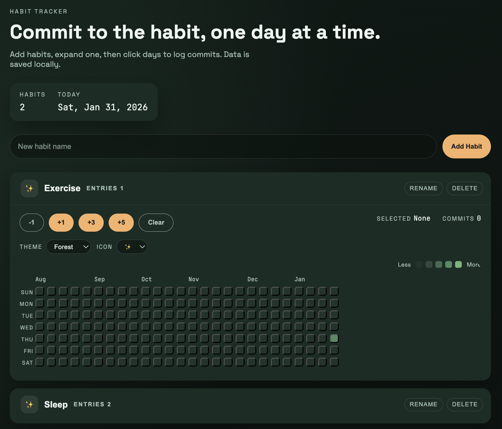

# Habit Tracker

A lightweight habit tracker inspired by the GitHub commit history grid. Create multiple habits, expand them in an accordion list, and log daily "commits" to build streaks over time. Each habit has its own theme and icon, and the page theme adapts to the active habit.

## Features
- GitHub-style commit calendar with month/day labels
- Multiple habits with accordion UI
- Per-habit icons and color themes
- Local storage persistence (no backend required)
- Hover-to-preview theme changes

## How it was created
This app was built with the Codex CLI. The UI, data model, and interactions were iteratively refined through Codex-driven prompts, resulting in a pure HTML/CSS/JavaScript implementation with localStorage for persistence.

## Run locally
Open `index.html` in your browser. No build steps required.
